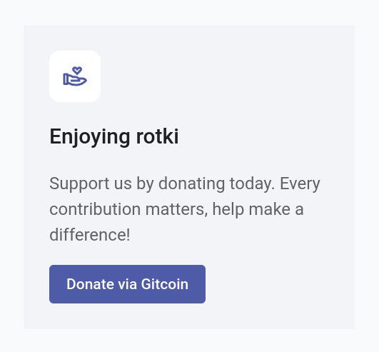
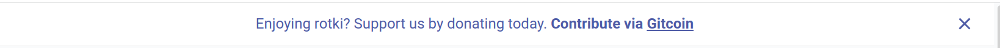

# Messages

In this directory you can put json files to show dynamic messages to the user.

## Welcome Screen



The filename has to be `welcome.json` and have the following schema.

```json
{
  "header": "Welcome to rotki", 
  "text": "The best app in the world.",
  "messages": [
    {
      "header": "Enjoying rotki",
      "icon": "https://raw.githubusercontent.com/gist/kelsos/4ffcd8f9310b1821a2ad7962262ea7ed/raw/789705f4b12ea6f65cf7dde390de2471662b7a80/icon.svg",
      "text": "Support us by donating today. Every contribution matters, help make a difference!",     
      "action": {
        "text": "Donate via Gitcoin",
        "url": "https://explorer.gitcoin.co/#/round/137/0xa1d52f9b5339792651861329a046dd912761e9a9/0xa1d52f9b5339792651861329a046dd912761e9a9-4"
      },
      "period": {
        "start": 1700562938,
        "end": 1700763733
      }
    }
  ]
}
```

- `header` is an **optional** field. It changes the welcome message header (if missing the default will be displayed).
- `text` is an **optional** field. It changes the welcome message text (if missing the default will be displayed).
- `messages` is a **required** array.

### Welcome message schema

- `header` is an **optional** field. If it exists it will show a header to the message box.
- `text` is a **required** field. It affects the body of text shown in the message box.
- `action` is an **optional** field. If it exists it is required to have a `text` and a `url` property. Action will appear as a button, with text being the button text and url the link that will open when clicking it.
- `icon` is an **optional** field. It has to be a link to an `svg` file, that is hosted in this repo.
- `period` is a **required** field. It is the period for which the message will be displayed in the application welcome area.

> If multiple messages overlap during a specific period only the first message will be shown.

> For icons you can use [remixicon.com](https://remixicon.com). Download the svg file and then commit it in the main branch of this repo in this directory so that
> the link would be something link `https://raw.githubusercontent.com/rotki/data/main/messages/arrow-left-up-line.svg` then put this link in the `icon` field in the welcome json.


## Dashboard



The filename has to be `dashboard.json` and have the following schema.

```json
[
  {
    "message": "Enjoying rotki? Support us by donating today.",
    "message_highlight": "Contribute via",
    "action": {
      "text": "Gitcoin",
      "url": "https://explorer.gitcoin.co/#/round/137/0xa1d52f9b5339792651861329a046dd912761e9a9/0xa1d52f9b5339792651861329a046dd912761e9a9-4"
    },
    "period": {
      "start": 1700562938,
      "end": 1700763733
    }
  }
]
```

- `message` is a **required** field. It will appear in normal text body style
- `message_highlight` is an **optional** field. It will appear in semi-bold after the messages and before the action
- `action` is an **optional** field. If it exists it is required to have a `text` and a `url` property. Action will appear as a link, with text being the link text and url the link that will open when clicking it.
- `period` is a **required** field. It is the period for which the message will be displayed in the application welcome area.